[TOC]


# 分类算法

## 树模型

> 可以进行多分类，但是无法指定分类的个数，这个与DBScan一样

### 决策树

```python
from sklearn import tree
dtr = tree.DecisionTreeRegressor(max_depth = 3) #采用的决策树回归模型，max_depth = 3表示层数
dtr.fit(housing.data[:, [6, 7]], housing.target) #传入数据，进行计算
```

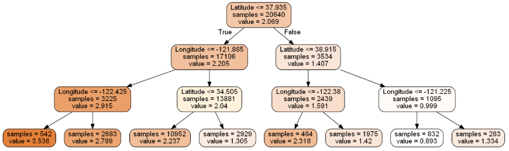

### 随机森林

```python
#随机森林
from sklearn.ensemble import RandomForestRegressor
rfr = RandomForestRegressor( random_state = 42)
rfr.fit(data_train, target_train)
rfr.score(data_test, target_test)
```

```python
#GridSearchCV：进行参数的自动选择
from sklearn.model_selection import GridSearchCV
#设置参数选择范围：min_samples_split：每个叶子节点的样本个数下限；n_estimators：随机森林中树的个数
tree_param_grid = { 'min_samples_split': list((3,6,9)),'n_estimators':list((10,50,100))}
#相当于是对所有的参数进行了遍历，cv=5表示5折交叉验证
#训练集；建立模型
#验证集：调整参数
#测试集：测试性能
grid = GridSearchCV(RandomForestRegressor(),param_grid=tree_param_grid, cv=5)
grid.fit(data_train, target_train) #训练
grid.cv_results_, grid.best_params_, grid.best_score_

rfr = RandomForestRegressor( min_samples_split=3,n_estimators = 100,random_state = 42)
rfr.fit(data_train, target_train)
rfr.score(data_test, target_test)
```

## 贝叶斯

### 贝叶斯-拼写检查器

### 贝叶斯Python文本分析


## 梯度下降求解逻辑回归

### 缺点：已实现的是一个二分类，可以进行多分类，未实现

### 优点：对梯度下降算法有着很详细的具体实现步骤，对理解梯度下降算法的具体实现有很好的借鉴意义


## 逻辑回归-信用卡欺诈检测

### 优点：对于非均衡数据的分类实现有很好的借鉴意义，采用了上采样的方法

### 缺点：已实现的是一个二分类，可以进行多分类，未实现

### 对混淆矩阵和k-fold交叉验证有很好的说明


# 聚类算法


## 聚类算法

可视化效果展示：

- [**DBScan**](https://www.naftaliharris.com/blog/visualizing-dbscan-clustering/)
- [**k-means**](https://www.naftaliharris.com/blog/visualizing-k-means-clustering/ )

### k-means

#### 介绍：基于距离的一种聚类算法

| 优点：简单，快速，适合常规数据集                  | 缺点：很难发现任意形状的簇                        |
| ------------------------------------------------- | ------------------------------------------------- |
| 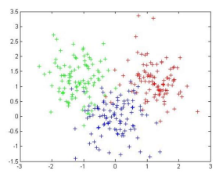 | 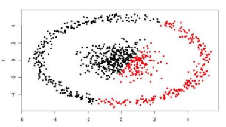 |


### DBScan

#### 介绍：基于密度的一种聚类算法

```python
from sklearn.cluster import DBSCAN
db = DBSCAN(eps=10, min_samples=2).fit(X) #指定半径eps和密度阈值min_samples
labels = db.labels_
```

#### 优点：对于不规则数据有很好的优势

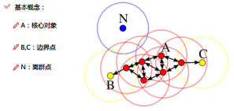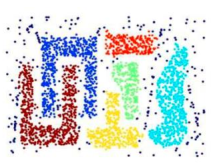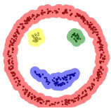

## EM（期望最大化）算法/GMM聚类：高斯混合模型

### 优点：相较与k-means只是基于距离的聚类算法而言，对于数据分布符合高斯分布的数据聚类有奇效。

### 效果对比

| k-means效果                                       | GMM效果                                           |
| ------------------------------------------------- | ------------------------------------------------- |
| 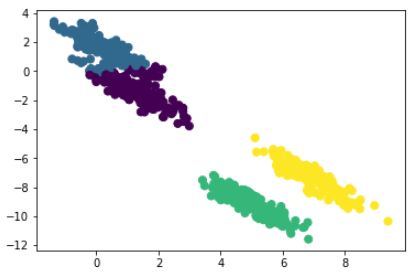 | 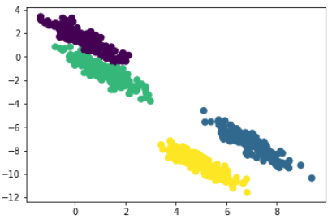 |


# 集成算法


# 降维算法

## LDA

### 监督性：LDA需要在有标签的情况下进行降维

```python
from sklearn.discriminant_analysis import LinearDiscriminantAnalysis as LDA

# LDA
sklearn_lda = LDA(n_components=2) #降维的维度
X_lda_sklearn = sklearn_lda.fit_transform(X, y) #导入相应的数据集及标签
X_lda_sklearn
```

## PCA

### 监督性：PCA不需要标签的情况下即可进行降维

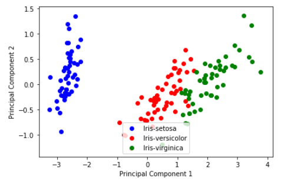

# 推荐算法

使用的算法工具包：[surprisr库官网](http://surprise.readthedocs.io/en/stable/index.html)

## 协同过滤

| 基于用户                                          | 基于商品                                          |
| ------------------------------------------------- | ------------------------------------------------- |
| 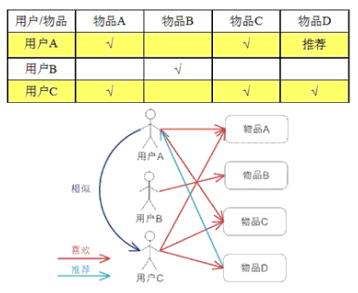 | 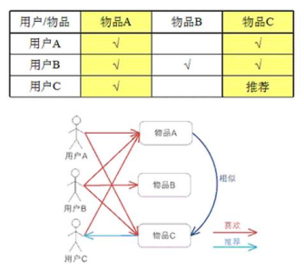 |

> 一般使用基于商品的较多，因为商品的属性一般商家会打上很多的标签，使得数据不那么稀疏。

## 隐语义模型

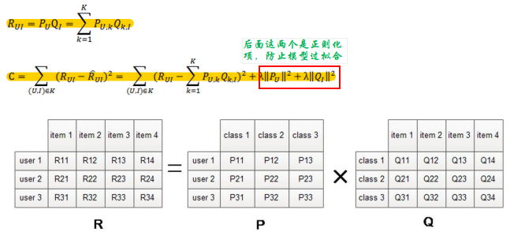

> 使用一个中间变量（隐含因子）将用户和物品分别联系在一起，R是一个用户对物品的打分矩阵。

